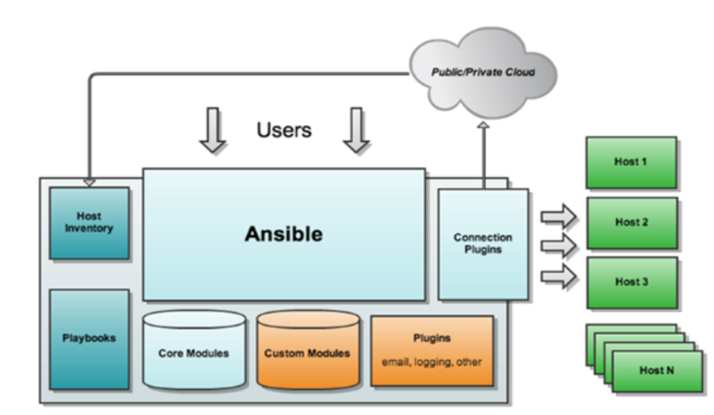

[TOC]

## ansible学习笔记

### ansible 介绍

Ansible是一种开源软件配置，配置管理和应用程序部署工具，可将基础结构作为代码启用。它可以在许多类Unix系统上运行，并且可以配置类Unix系统和Microsoft Windows。它包含自己的声明性语言来描述系统配置。

**特点:**

- 轻量级，无需安装Agent
- 命令可单条执行，可编写成剧本，支持条件判断、循环
- u基于SSH，Kerberos，LDAP等协议工作
- 基于python开发，简单易维护

### ansible 架构原理




### ansible 安装

> yum 安装
>
> - 配置epel源
>
> - 执行 `yum install -y ansible`
>
>   ```shell
>   cd /etc/yum.repos.d/
>   for i in $(ls ./);do echo $i; mv $i $i.bak.2021.01.11 ;done
>   wget -O /etc/yum.repos.d/CentOS-Base.repo https://mirrors.aliyun.com/repo/Centos-7.repo
>   wget -O /etc/yum.repos.d/epel.repo http://mirrors.aliyun.com/repo/epel-7.repo
>   yum clean all
>   yum makecache
>   yum -y install ansible
>   ansible --version
>   ```
>
> - 源码安装
>
> - pip安装

### ansible 配置文件

> /etc/ansible/ansible.cfg      #配置文件
>
> - host_key_checking	ssh检查
> - log_path		日志记录
>
> /etc/ansible/hosts               #默认主机清单，可以修改，在执行playbook的时候可以通过  -i  参数指定主机清单
>
> - 可以设置组
>
>   [webserver]
>
>   192.168.1.100
>
>   192.168.1.101
>
> - 定义变量
>
>   [webserver]
>
>   192.168.1.100      ansible_port=80    ansible_user=javen
>
>   192.168.1.101      ansible_port=81
>
> - 支持模式匹配
>
>   在使用 脚本的时候:  ansible __web*__ -m ping

### ansible 命令

#### ansible 命令

- ansible                     # 执行ansible单条命令,ansible称这种方式为临时命令(Ansible Ad-Hoc)。

- ansible-doc             # 查看ansible 模块说明

- ansible-galaxy        # 连接https://galaxy.ansible.com/ 下载相应的roles

  ```shell
  #列出所有已经安装的 galaxy
  ansible-galaxy list
  #安装galaxy
  ansible-galaxy install andrewrothstein.etcd
  ansible-galaxy install geerlingguy.jenkins
  #删除galaxy
  ansible-galaxy remove andrewrothstein.etcd
  
  ```

- ansible-pull           #推送命令至远程

- ansible-playbook  #

- ansible-vault          #管理加密解密yml文件

- ansibl-console        #执行交互式命令的界面

#### ansible 常见模块

* ping 模块

  - `ansible servername -m ping -u username -k`

* command 模块

  * `ansible 192.168.* -m command -a 'ls /'`
  * `ansible  192.168.* -a 'ls /'`     默认为command 模块，可以忽略。

* shell 模块

  * `ansible 192.168.* -m shell -a 'ls /'`

  > 有很多情况下，command 模块不支持了，就需要使用shell模块，如下面的情况：
  >
  > <u>___下面的输出是将单引号里面的内容原样输出了___</u>
  >
  > ```shell
  > ansible 192.168* -a 'echo 123 | grep 3'
  > 输出：
  > 192.168.xxx.xxx | CHANGED | rc=0 >>
  > 123 | grep 3
  > ```
  >
  > <u>___下面是使用shell模块的效果___</u>
  >
  > ```shell
  > ansible 192.168* -m  shell -a 'echo 123 | grep 3'
  > 输出：
  > 192.168.xxx.xxx | CHANGED | rc=0 >>
  > 123
  > ```

* script 模块

  - `ansible  192.168.* -m script -a 'host.sh args'`

* copy 模块

  * 将主控机的文件拷贝到受控机

    `ansible ubuntu -m copy -a 'src=/etc/ansible/shell dest=~/ansible/tmp/'`

* fetch 模块

  * 将受控机的文件拷贝到主控机

    `ansible ubuntu -m fetch -a 'src=~/.ansible/tmp/test/hello.txt dest=~/.ansible/'`

* file 模块

* setup 模块

* templates 模块

#### ansible命令执行过程

``` sequence
Title : Ansible命令执行过程

ansible -> ansible : 加载自己的配置文件\n（/etc/ansible/ansible.cfg）
#Note right of ansible :/etc/ansible/ansible.cfg
ansible -> ansible : 加载自己的模块文件\n(如 ping、 command)
ansible -> ansible : 生成临时py文件\n(~/.ansible/tmp/)
ansible -> remote server : 将py传输至远程受控机(~/.ansible/tmp)
#Note right of remote server : ansible支持批量的操作\n这里的remote server可以是多台主机
Note over remote server : ansible支持批量的操作\n这里的remote server可以是多台主机
remote server -> remote server : 给文件增加执行权限,并执行 (+x)
remote server --> ansible :返回执行结果
remote server -> remote server : 删除临时文件


```

#### ansible 远程调试

> - ansible默认在执行完modules，会自动清理在远程主机上的临时文件。
>   使用 ___`ANSIBLE_KEEP_REMOTE_FILES=1`___ 环境变量 ，可以保留ansible在远程主机的执行文件，从而在远程主机上调试模块。
>
> - 使用 -v、-vv、-vvv 可以查看ansible执行的详细日志

### ansible playbook

> ##### playbook 核心元素
> - hosts 执行的远程主机列表
> - tasks 任务集
> - varniables 内置变量或者自定义变量在playbook中调用
> - templates 模板，可替换模板文件中的变量并实现一些简单逻辑的文件
> - handlers 和 notify结合使用，由特定条件触发，满足条件才执行，否则不执行
> - tags 标签，指定某条任务执行，用于选择playbook中的部分代码，ansible具有幂等性，因此会自动跳过没有变化的部分，即便如此，有些代码为了测试其确实没有发生变化的时间很长。此时，如果确定没有变化，就可以通过tags跳过这些代码片段
>   `ansible-playbook -t tagsname useradd.yml`

### templates 模板

> jinja2语言

### role 介绍

> 下载role：通过在[ansible-galaxy](https://galaxy.ansible.com/home)的网站上面搜索下载自己需要的role。
>
> ```shell
> geerlingguy.jenkins   	#每一个文件夹就是一个role
> ├── defaults			#设定默认变量时使用此目录中的main.yml
> │   └── main.yml
> ├── handlers			#至少有一个main.yml，其他文件通过include包含
> │   └── main.yml
> ├── LICENSE
> ├── meta			#至少有一个main.yml，其他文件通过include包含，定义当前角色的特殊设定及依赖关系
> │   └── main.yml
> ├── molecule
> │   └── default
> │       ├── converge.yml
> │       ├── java-11.yml
> │       ├── java-8.yml
> │       ├── molecule.yml
> │       ├── playbook-http-port.yml
> │       ├── playbook-jenkins-version.yml
> │       ├── playbook-plugins-with-home.yml
> │       ├── playbook-prefix.yml
> │       └── requirements.yml
> ├── README.md
> ├── tasks			#至少有一个main.yml，其他文件通过include包含,定义task的基本元素
> │   ├── main.yml
> │   ├── plugins.yml
> │   ├── settings.yml
> │   ├── setup-Debian.yml
> │   └── setup-RedHat.yml
> ├── templates		#存放模板文件
> │   ├── basic-security.groovy.j2
> │   └── proxy.xml
> ├── tests
> │   └── test-plugins.yml
> └── vars			#至少有一个main.yml，其他文件通过include包含,定义变量的目录
>  ├── Debian.yml
>  └── RedHat.yml
> 
> ```
>

### 其他系统设置

#### seLinux 设置

> ##### seLinux：
>
> ```text
>  SELinux(Security-Enhanced Linux) 是美国国家安全局NSA对于强制访问控制的实现，是 Linux历史上最杰出的新安全子系统。NSA是在Linux社区的帮助下开发了一种访问控制体系，在这种访问控制体系的限制下，进程只能访问那些在他的任务中所需要文件。SELinux 默认安装在 Fedora 和 Red Hat Enterprise Linux 上，也可以作为其他发行版上容易安装的包得到。
> ```
>
> ---
>
> ##### 查看SELinux状态：
>
> 1、/usr/sbin/sestatus -v      #如果SELinux status参数为enabled即为开启状态
>
> `SELinux status:                 enabled`
>
> 2、getenforce                 #也可以用这个命令检查
>
> ---
>
> ##### 关闭SELinux：
>
> 1、临时关闭（不用重启机器）：
>
> setenforce 0                  #设置SELinux 成为permissive模式
>
> setenforce 1				 #setenforce 1 设置SELinux 成为enforcing模式 
>
> 2、修改配置文件需要重启机器：
>
> 修改/etc/selinux/config 文件
>
> 将SELINUX=enforcing改为SELINUX=disabled
>
> 重启机器即可
>
> ---
>

#### 服务器建立互信

> ssh-keygen
>
> ssh-copy-id 10.1.xx.xxx     

### others

- jenkins下载慢的问题

  ```shell
  $ wget -O /etc/yum.repos.d/jenkins.repo https://pkg.jenkins.io/redhat-stable/jenkins.repo
  $ vi /etc/yum.repos.d/jenkins.repo
  
  [jenkins]
  name=Jenkins-stable
  baseurl=https://mirrors.huaweicloud.com/jenkins/redhat-stable
  gpgcheck=1
  ```

- 安装redis
  - ansible-galaxy install davidwittman.redis
  - 编写playbook
  - 执行playbook 安装redis

