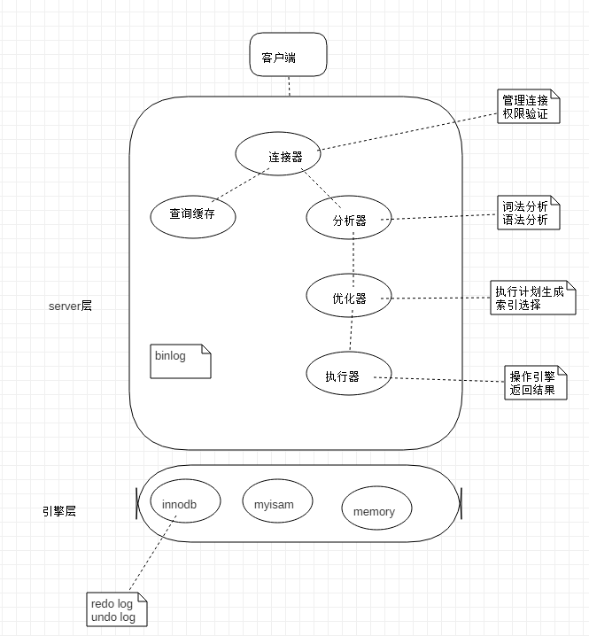

## mysql 学习笔记

[TOC]

### 基础架构

### 日志系统

binlog

redo log

undo log

### 事务隔离

ACID：

- Atomicity    原子性
- Consistency    一致性
- Isolation    隔离性
- Durability    持久性

数据库上多个事务同事操作的时候，就可能会出现 ***脏读、不可重复读、幻读*** 的问题。

隔离级别：

- 读未提交：
- 读提交：
- 可重复读：
- 串行化：

